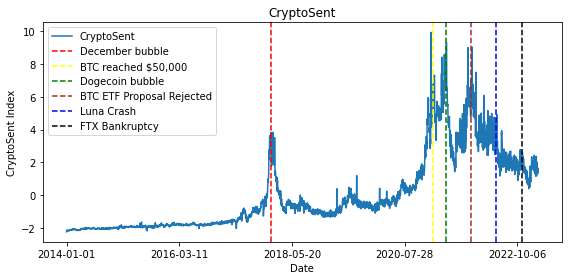

# Sentiment in the Cross Section of Cryptocurrency Returns



## Abstract
In [this paper](https://papers.ssrn.com/sol3/papers.cfm?abstract_id=5291650), we analyze sentiment in the cross-section of cryptocurrency returns. We construct a cryptocurrency sentiment index named "CryptoSent." We find that cryptocurrencies with high absolute sensitivities to CryptoSent innovations tend to yield lower average returns in the following month and subsequent week. We introduce a sentiment factor as a common risk factor in the cross-sectional returns of cryptocurrencies, alongside market, size, and momentum factors. Incorporating the sentiment factor increases the three-factor model's explanatory power by 13\% and substantially reduces the alphas of eleven characteristic‐based long–short portfolios. The sentiment factor possesses both economic and statistical significance in explaining eleven cryptocurrency characteristics-based long-short strategies.

## Methodology of CryptoSent

We compute the overall CryptoSent following the methodology of [Baker and Wurgler (2006)](https://doi.org/10.1111/j.1540-6261.2006.00885.x). We form a composite index that captures the common component among the eight components (including the cryptocurrency market index, market volatility, market volume, google trends of "cryptocurrency", tweets discussion, the number of active wallets on blockchain, initial coin offerings on the Ethereum blockchain, and blockchain transactions) and accounts for the fact that some variables take longer to reflect the same sentiment. We begin by estimating the first principal component of the eight components and their lags. This yields a first-stage index with 16 loadings, one for each of the current and lagged components. We then compute the correlation between the first-stage index and the current and lagged values of each proxy. Finally, we define “CryptoSent” as the first principal component of the correlation matrix of eight variables – each respective proxy’s lead or lag, whichever has a higher correlation with the first-stage index – rescaling the coefficients to ensure the index has unit variance. This procedure results in the index:

$$
\begin{aligned}
CryptoSent_t =\ & 0.4095\times Crypto\ Index_{t-1} \\
&+ 0.2701\times Google\ Trend_t \\
&+ 0.3759\times Tweet_{t-1} \\
&+ 0.3678\times Volatility_t \\
&+ 0.3882\times Volume_{t-1} \\
&+ 0.3840\times Wallet_t
\end{aligned}
$$


## Time Series Data of CryptoSent

This repository provides the CryptoSent we construct in the paper. If you find it helpful to use the data, please cite [our paper](https://papers.ssrn.com/sol3/papers.cfm?abstract_id=5291650):

```
@article{JohnLiLiu2024sentiment,
  title={Sentiment in the Cross Section of Cryptocurrency Returns},
  author={John, Kose and Li, Jingrui and Liu, Ruming},
  journal={NYU Stern School of Business Research Paper},
  year={2024}
}
```
